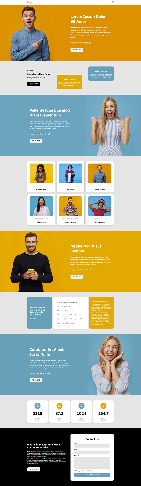
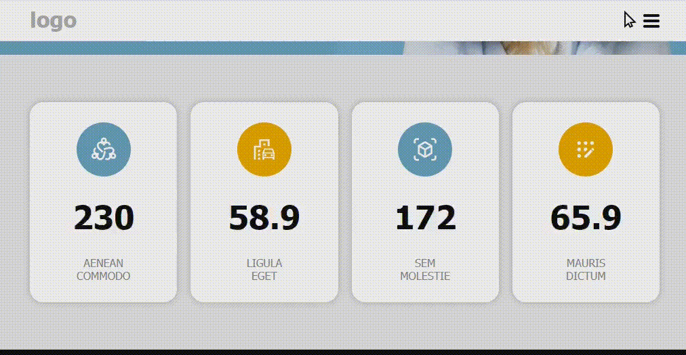

# Web Page 4

Page markup is done using SCSS, flexbox layout, and has responsive design. Demo link is [here](https://kulyk-volodymyr.github.io/web-page-4/).

The header has a fixed position. The hamburger menu is implemented using CSS and JavaScript. There is a scroll-animated counter at the bottom of the page.

